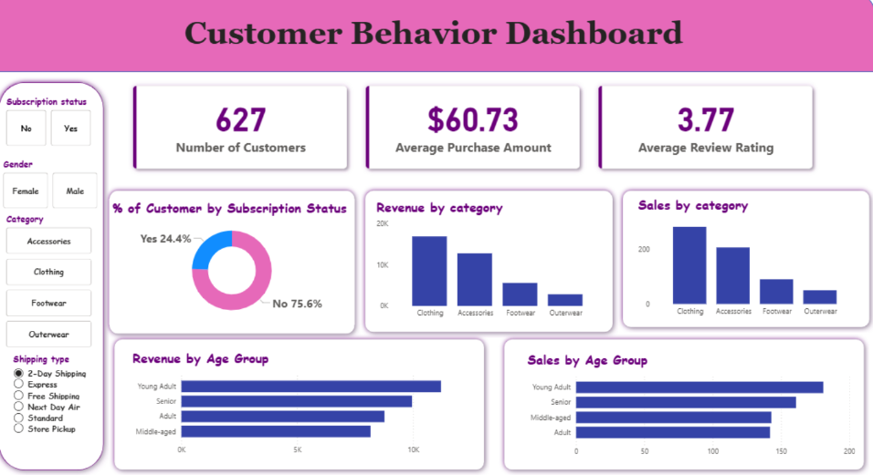

# End-to-End Customer Purchase Behavior Analytics  
### Using Python, MySQL & Power BI

---

## Overview

This project builds a complete analytics pipeline to explore customer purchasing behavior using transactional retail data.

The dataset is processed and cleaned in Python, stored and analyzed using MySQL, and visualized through an interactive Power BI dashboard. The goal is to transform raw transactional data into meaningful insights that support business analysis and decision-making.

The project demonstrates how multiple data tools can work together in a realistic analytics workflow.

---

## Business Problem

Retail organizations collect large volumes of transactional data but often struggle to convert raw purchase records into actionable insights.

Understanding customer purchasing patterns, product category performance, and payment behavior can help businesses make informed decisions about inventory, promotions, and pricing strategies.

This project analyzes purchase behavior data to demonstrate how analytics pipelines can generate meaningful insights from raw transactional data.

---

## Dataset

The dataset contains transactional purchase records including product details, pricing, payment methods, and order timestamps.

Key attributes include:

- Product category
- Transaction date
- Payment method
- Discount usage
- Purchase value

These attributes allow analysis of sales trends, customer purchasing behavior, and revenue contributions.

---

## Project Workflow

### 1. Data Preparation (Python)

- Loaded the raw dataset into Jupyter Notebook
- Inspected dataset structure and column types
- Identified and handled missing values
- Cleaned date formats and categorical fields
- Created new calculated attributes such as **Total Sales**
- Exported cleaned dataset for database storage

---

### 2. Database Analysis (MySQL)

- Imported cleaned dataset into **MySQL**
- Performed analytical SQL queries including:

  - Sales trends over time
  - Revenue contribution by product category
  - Payment method distribution
  - Discount usage patterns

- Used SQL results to support dashboard analysis

---

### 3. Dashboard Visualization (Power BI)

- Connected Power BI to MySQL database
- Built interactive dashboard components including:

  - Revenue KPIs
  - Category-level sales comparisons
  - Time-series purchase trends
  - Payment method distribution charts

- Added filters for category, payment type, and date ranges

---

## Dashboard Preview

---

## Key Insights

Exploratory analysis of the dataset revealed several patterns in customer purchasing behavior:

- Certain product categories contributed a large portion of total revenue.
- Payment method preferences varied across transaction segments.
- Discount usage influenced purchasing frequency and order size.

These findings demonstrate how combining Python preprocessing, SQL analytics, and Power BI visualization can support data-driven retail insights.

---

## Technical Stack

- Python
- Pandas
- MySQL
- SQL
- Power BI
- Jupyter Notebook

---

## Skills Demonstrated

- Data cleaning and preprocessing
- SQL-based analytical querying
- Dashboard design and visualization
- Business data exploration
- End-to-end analytics pipeline development

---

## Project Deliverables

This repository contains:

- Raw dataset (.csv)
- Data cleaning notebook (.ipynb)
- Analytical SQL queries (.sql)
- Power BI dashboard (.pbix)
- Project report (.pdf)
- Presentation slides (.pptx)

---

## Author

**Kavya Balaji Singh**
